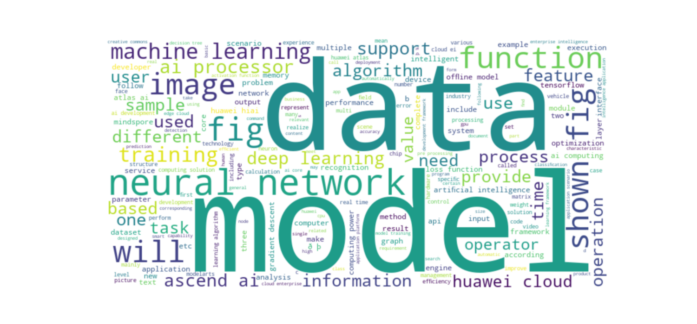

Below is a **detailed, professional, GitHub-ready `README.md`** tailored **exactly to your project and code**.
You can copy-paste this directly into `README.md`.

---

# 📄 PDF Text Mining & NLP Analysis using Python

## 📌 Project Overview

This project implements a **complete text mining pipeline** for analyzing PDF documents using Python.
It extracts raw text from PDFs, cleans and preprocesses the text, performs statistical text mining (word frequencies, n-grams), and visualizes results using a **word cloud**.

The project is designed to demonstrate **core NLP fundamentals** without relying on heavy machine learning frameworks.

---

## 🎯 Objectives

* Extract text from PDF files
* Clean and preprocess raw text
* Perform word frequency analysis
* Generate bigrams and trigrams (n-grams)
* Visualize important words using a word cloud
* Build a modular, reusable NLP pipeline

---

## 🛠️ Tech Stack

* **Python 3**
* **PyMuPDF (`fitz`)** – PDF text extraction
* **WordCloud** – Visualization
* **Matplotlib** – Plotting
* **Collections (Counter)** – Frequency analysis
* **Virtual Environment (venv)** – Dependency isolation

---

## 📂 Project Structure

```
text-mining-pdf/
│
├── text_extraction.py        # PDF text extraction logic
├── Chunking.py               # Text chunking logic
├── main.py                   # Main pipeline
├── requirements.txt          # Project dependencies
├── README.md                 # Project documentation
├── .gitignore                # Ignored files
└── sample_output/
    └── wordcloud.png         # Example output
```

---

## ⚙️ Installation & Setup

### 1️⃣ Clone the repository

```bash
git clone https://github.com/your-username/text-mining-pdf.git
cd text-mining-pdf
```

---

### 2️⃣ Create & activate virtual environment

```bash
python -m venv venv
venv\Scripts\activate
```

---

### 3️⃣ Install dependencies

```bash
pip install -r requirements.txt
```

---

### 4️⃣ Add your PDF file

Place your PDF file in the project root directory.

> ⚠️ PDFs are ignored in `.gitignore` to avoid copyright issues.

---

## ▶️ How to Run

```bash
python main.py
```

---

## 🔄 Processing Pipeline (Step-by-Step)

### **Step 1: PDF Text Extraction**

Uses **PyMuPDF** to extract text page-by-page from PDF files.

```python
RawText = PdfTextExtraction("aibook.pdf")
```

---

### **Step 2: Text Chunking**

Splits long text into manageable chunks for processing.

```python
Chunks = MakeChunks(RawText)
```

---

### **Step 3: Text Cleaning & Tokenization**

* Converts text to lowercase
* Removes punctuation
* Splits text into tokens (words)

```python
AllTokens = ChunkTextCleaning(Chunks)
```

---

### **Step 4: Stopword Removal**

Common words like *the, of, is, and* are removed to focus on meaningful content.

---

### **Step 5: Word Frequency Analysis**

Finds the most frequently occurring words.

**Example Output:**

```
Top 10 most common words:
[('ai', 1157), ('model', 971), ('data', 785), ...]
```

---

### **Step 6: N-gram Analysis**

Identifies frequently occurring phrases.

#### Bigrams (2 words):

```
('machine', 'learning')
('neural', 'network')
```

#### Trigrams (3 words):

```
('ascend', 'ai', 'processor')
('ai', 'computing', 'solution')
```

---

### **Step 7: Word Cloud Visualization**

Displays word importance visually based on frequency.

```python
generate_wordcloud(AllTokens)
```

📌 Larger words = higher frequency
📌 Colors are decorative
📌 Shape is randomized

---

## 📊 Sample Output

### 🔹 Top Words

```
AI, model, data, learning, neural
```

### 🔹 Top Bigrams

```
machine learning
neural network
deep learning
```

### 🔹 Word Cloud



---

## 💡 Why N-grams?

| Feature  | What it shows           |
| -------- | ----------------------- |
| Unigrams | Important single words  |
| Bigrams  | Meaningful word pairs   |
| Trigrams | Domain-specific phrases |

Example:

* ❌ `machine` (alone)
* ✅ `machine learning` (meaningful concept)

---

## 🚀 Use Cases

* Academic PDF analysis
* Book or research paper mining
* Topic exploration
* NLP learning project
* Resume / portfolio project

---

## 🔐 Notes

* PDFs are **not included** in the repository
* Ensure your virtual environment is activated
* Works best on **text-heavy PDFs**

---

## 📌 Future Improvements

* TF-IDF analysis
* Named Entity Recognition (NER)
* Topic modeling (LDA)
* Export results to CSV
* Web interface (Streamlit)

---

## 👤 Author

**Vignesh Mudaliyar**
Computer Science / AI Student
📫 GitHub: [https://github.com/Vignesh-99999](https://github.com/Vignesh-99999)

---

## ⭐ If you like this project

Give it a ⭐ on GitHub and feel free to fork it!

